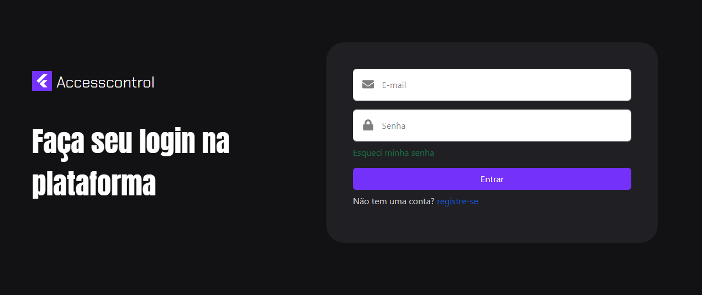
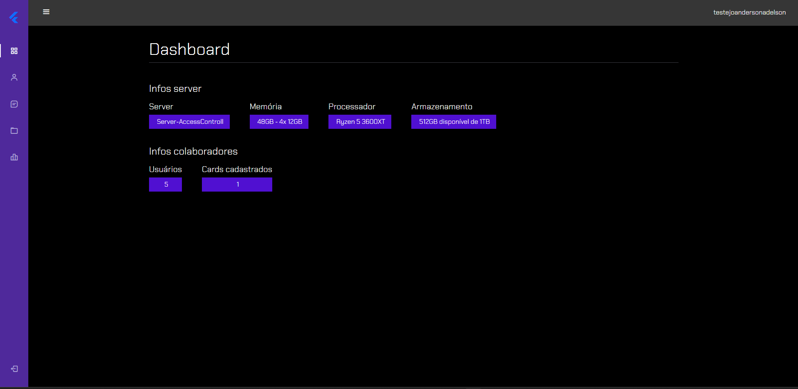
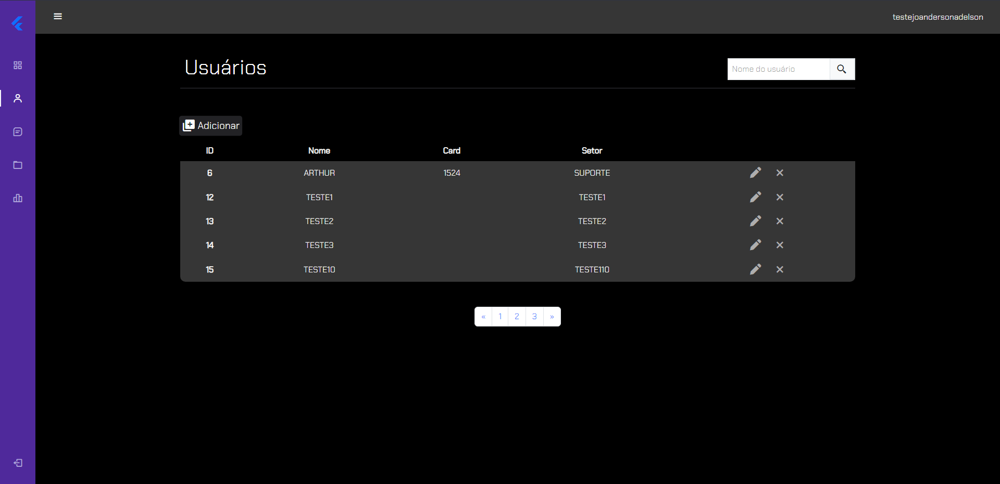
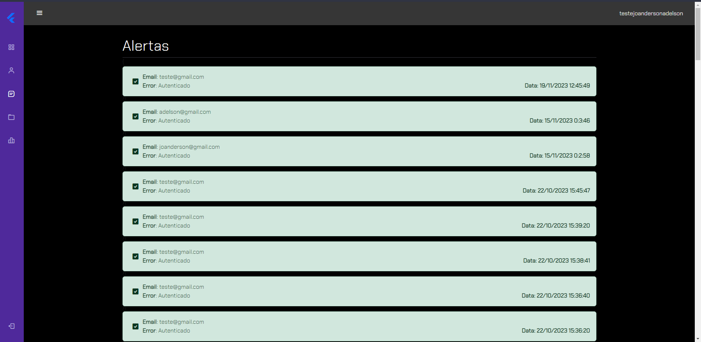

# AccessControl - Controle de Acesso

#### Nesse projeto iremos desenvolver um sistema para controle de acessos de usuários de uma umpresa
##### Site criado por: Joanderson para o projeto de DW

 

Primeira tela: 
*A tela de login está quase pronta. Abaixo um esbolço da nossa primeira tela onde o usuário autorizado vai ter acesso.*

Para que o projeto funcione é preciso instalar o Vite, Bootstrap e Json-Server

*npm i bootstrap*  
*npm create vite@latest control -- --template vanilla* 
*npm install js-md5* 
*npm install express* 
*npx prisma migrate dev --name app* 

Para poder rodar o prisma é preciso acessar a pasta Prisma e rodar os seguinte comando:
*npm run dev*

Para poder rodar o vite na raiz do projeto rode o comando:
*npm run dev*

Tela Principal - Dashboard: 

Tela De Users - Usuários: 

Tela De Alerts - Alerts: 
