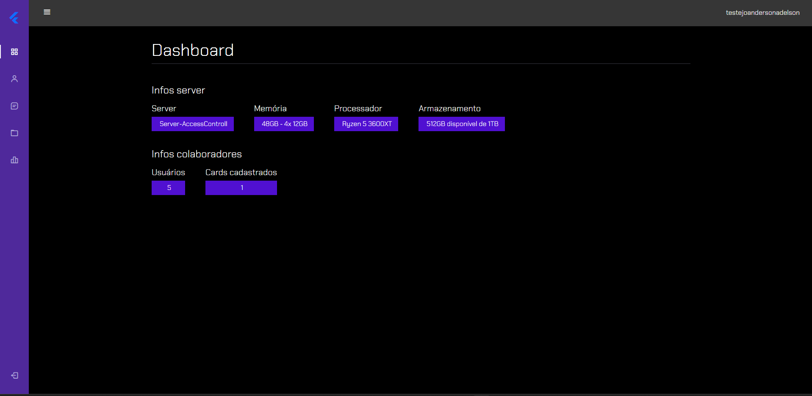
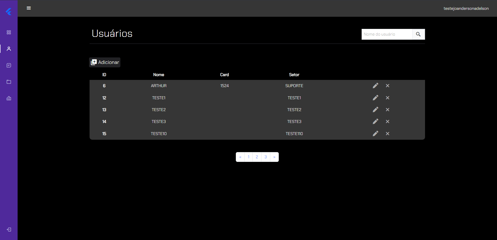
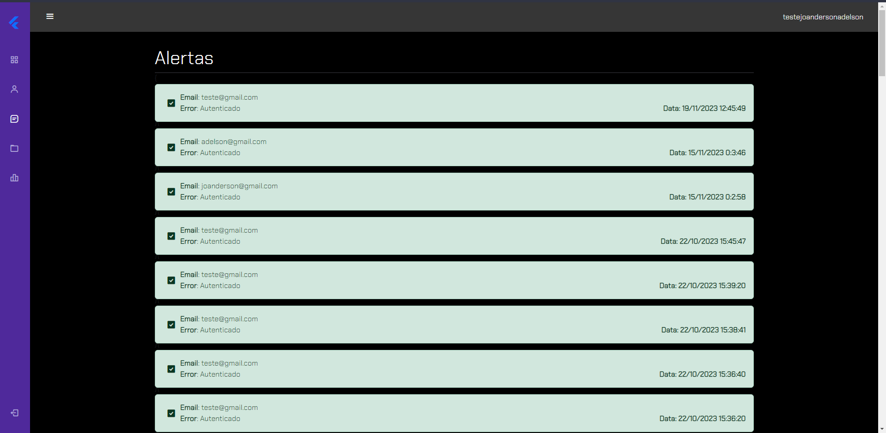

# AccessControl - Controle de Acesso

#### Nesse projeto iremos desenvolver um sistema para controle de acessos de usuários de uma umpresa
##### O grupo é formado por: Arthur, Joanderson e Adelson

 

Primeira tela: 
*A tela de login está quase pronta. Abaixo um esbolço da nossa primeira tela onde o usuário autorizado vai ter acesso.*

Para que o projeto funcione é preciso instalar o Vite, Bootstrap e Json-Server

*npm i bootstrap*  
*npm i json-server* 
*npm create vite@latest control -- --template vanilla* 
*npm install js-md5* 
*npm install express* 

Para poder rodar o Json-server acesse a pasta Json-Server e utilize o seguinte comando.
*npx json-server -H 0.0.0.0 --watch db.json*

Tela Principal - Dashboard: 

Tela De Users - Usuários: 

Tela De Alerts - Alerts: 
